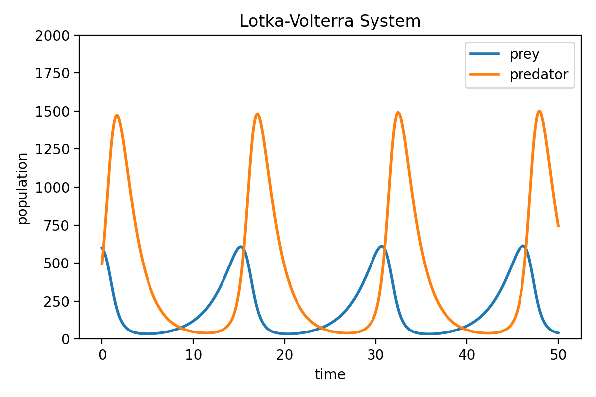

# Lotka-Volterra equations

This repository contains the code for the blog post on [The Lotka-Volterra equations: Modeling predator-prey dynamics](https://www.fabriziomusacchio.com/blog/2021-01-05-lotka_volterra_system/). For further details, please refer to this post.



For reproducibility:

```powershell
conda create -n lotkavolterra -y python=3.9
conda activate lotkavolterra
conda install mamba -y
mamba install -y numpy matplotlib scikit-learn ipykernel
```
